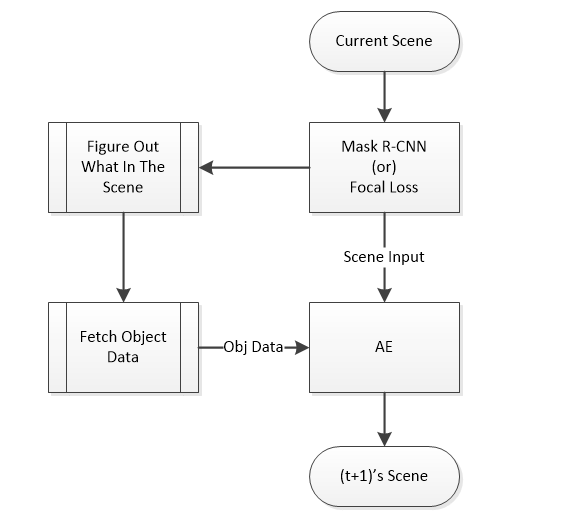

# generalAI #

## Summerize ##
Intelligent is base on a setted goal. Our goal is to make the most of our life experience. Then there are bulk of definitions, that define what kind of things lead to what kind of emotion. like or dislike this emotion was setted, thus our life was setted. 

GeneralAI is a project that tries to make a general AI base on this philosophy. GeneralAI will  live in the virtul world <a href="http://wuxia.qq.com/main.shtml">The Moonlight Blade</a>. The moonlight blade is a pc game create by tencent. The world is vast and complicated, player has lots of thing to learn and to do. The scenery is close to reality, I saw somebody said he had masturbated with the character of the game. When generalAI learn to control a character as a human does, and nobody find out it is a robot, we succeed. There won't be a code as the type: if condition, do action, all thing, all action, gerneralAI gather from learning.

This is a long way to go. I gona seperate the final goal into several small part. The first goal is to make this AI knows auto tracing object. It means that the AI will be setted to auto trace object. This task seems easy to complete, but I will make it further. 

## Tracing Object ##
Just trace an object is easy, but i need it to auto trace all objects. AI will trace the object base on interest, the interest will be predefined. basicaly, new things, big things, strange thing first. To recognize new thing or *old thing*, it need to record object. *Recording Object* is the core of tracing object, it will help AI recognize and reconstruct world. 

## Recording object && Movement Recognize && Scenery Reconstruct and Prediction ##
Tracing an object will not be easy until AI has the ability to record objects. Maybe some prediction of the movement is also need. I used to think it would be hard to cover these three core structure: *Recording object, Movement Recognize, Scenery Reconstruct and Prediction*. After careful consideration, and some innovation to the artificial neral network, I found a structure that base on several kind of neral network could make them all hapend. Things are so complicated within this strcture that I couldn't tell them all. I just know, it will works!

Before going too deep into this concept, I now make some limitations or definitions to this discussion. Now I just focus on visual processing, not include audio, or some other sensors. but they will be involed one day. 

This structure basicly consists of several kinds of network. The first one is so call *<a href="http://blog.csdn.net/inuchiyo_china/article/details/70860939">Mask R-CNN</a>* or *<a href="http://blog.csdn.net/u014380165/article/details/77019084">Focal Loss</a>*. this kind of network help to figure out what is in the piture. and moreover, this jobs is supported by worldwide scientist. The second network is proposed by myself. I make some tricks to the original autoencoder to make it predictable and recordable. Original autoencode learn another expression to the original picture and try to make the input same as output. But the real world is always change among time. My AE try to present the time (t+1)'s picture if t's picture is given. This network has an intersting property, whose output isn't the same as the input, but part of them the same, and part of them differ. Originally, an AE should promise the output is the same as the input as much as possible. So my AE should also inherit this good tradition, it should at least try to make the same part similar to the correlate input as much as possible. And this noval change will help the training of the network more fascinating.

Imagine a data set that remember an object. And it will return the answer you want to know about the object. Such as age, face, body high, something happended, ect. The data set might large enough to matain almost every thing about this object, and the data type is distribute over images, sound, touch sensor's data, and digits that well defined. The disadvantages is that all data that needed must be well defined. And with this data roll up together to output a more compress version of this data. So we need another AE to do this thing. But gernerally, there should be more kind of network to extract information to commpete the data set about the object. Well, the most tough work is to define what atrribute is need to present the object, they are so many, and multifarious.

### Talking About Comprehension ###
Despite linguistic definition on comprehension, I give the definition here by intuition and it is also easy to infer: Comprehension is the procedure that from original state to a more meaningful/abundant/essential/predicted state.

## Life Meaning Definition And Strategy Optimize ##

## something else ##

## Basic Ability ##
Basic Abilitity model will be put at the first to do among coding. it is rock-bottom, important, large and complicatied. some of the BA are: classification, action serise and state series definition. classification will basic on some more basic ability like: find two things' similarity, sense of beauty,  for more detail please refer to the doc on schedule.
1. C net
2. S net
3. G net
4. Similarity
5. Better or Worst
